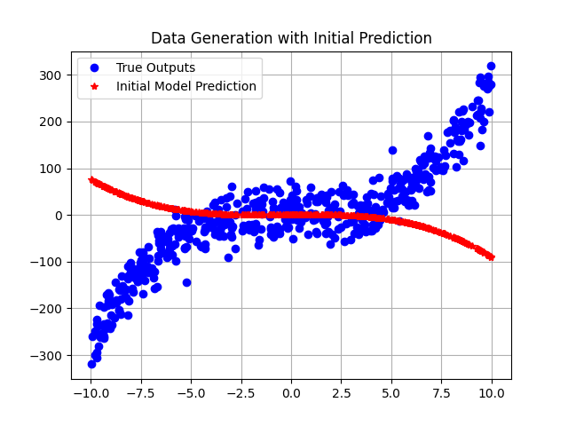
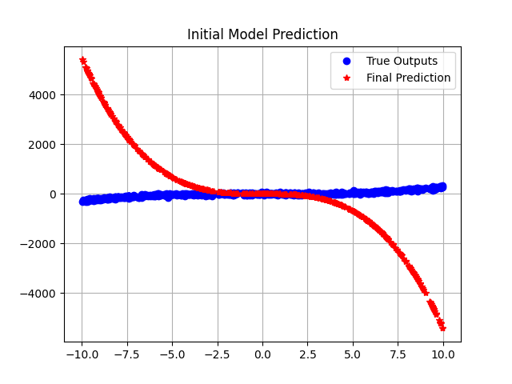
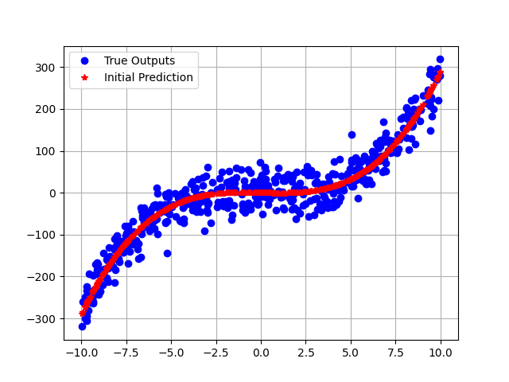

# Polynomial Regression Project

This project implements a polynomial regression algorithm from scratch using Python. The model is capable of fitting a polynomial to a given set of data points and is tested on synthetic data generated within the project.

## Features

- Generates 1D polynomial data with adjustable noise.
- Fits a polynomial model to the data using gradient descent.
- Visualizes the initial data, model predictions before training, and model predictions after training.

## Prerequisites

To run this project, you'll need the following Python packages:
- `NumPy` (for numerical computations)
- `Matplotlib` (for plotting results)

You can install these packages using pip:

```bash
pip install numpy matplotlib
```
## Installation
Clone this repository to your local machine using the following command:
`git clone https://github.com/your username/polynomial_regression_from_scratch.git`

Navigate to the cloned directory: `cd polynomial_regression_from_scratch`

## Usage
To run the project, simply execute the main.py script with Python: 
```
python main.py
```

This will generate three plots:
* 1 The initial synthetic data with the true polynomial curve.
* 2 The initial predictions of the model before training.
* 3 The predictions of the model after training with gradient descent.

## Project Structure

* `functions.py`: This script contains all necessary functions, including data generation, weight initialization, gradient descent algorithm, and plotting functions.
* `main.py`: The main script that uses the functions defined in functions.py to drive the polynomial regression process.


## Results

Upon running the `main.py` script, you will see three plots:

1. **Data Generation**: A plot showing the generated data points and the actual polynomial curve without noise.

   

2. **Initial Model Prediction**: A plot showing the model's predictions before training, which may not fit the data well.

   

3. **Model Prediction After Training**: A plot showing the improved fit of the model to the data points after training with gradient descent.

   


## Contributing

If you're interested in contributing to this project, please fork the repository and use a feature branch for your contributions. Pull requests are very welcome!

